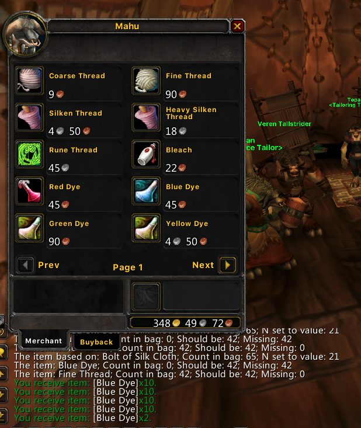

# Auto purchase item(s) based on the count of another item

I didn't find any addon does the job, so wrote one myself.

The supported string format is following, the first item is the base item,

`ItemName1:/3;ItemName2:*2;ItemName3:*3`

The above example stands for the following,

`N = int(Count(ItemName1)/3)`- The number `N` will be used to do the purchase.

`Purchase ItemName2, count N*2`

`Purchase ItemName3, count N*3`

Create a macro in the game with the following content,

`/LSAutoPurchaseTBC ItemName1:/3;ItemName2:*2;ItemName3:*3`

# Use case

My game character learned tailoring and enchanting, I usually buy clothes from auction, craft and disenchant. I am tried of calcuting the number of cloth bolts in my bag and buy the right number of martrials from merchants.

`/LSAutoPurchaseTBC Bolt of Silk Cloth:/3;Blue Dye:*2;Fine Thread:*2`

The above macro can purchase the right number of blue dyes and fine threads from merchant, based on the number of silk cloth bolts.

Run the macro anytime, it checks the numbers as the following image,

Talk to a merchant, and run the macro again, if the merchant has items available, the macro will do the purchase.

# Other version?

Currently I am only foucs on TBC, not playing others, so only TBC is provided here.
